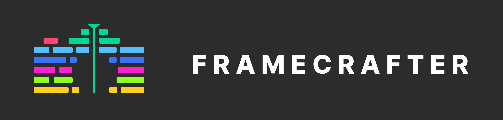

<h2 align="center">
Fast, extensible, video editor in the browser.
</h2>

---

> **Warning**
> This project is _very_ early and most code here might be WIP, POC, or simply non-functional. For up-to-date information about the project status, please join us [on Discord](https://discord.gg/HtHcnA3tT9).

## 🤔 Motivation

Video is becoming the most important medium for sharing information online. Apps like TikTok and YouTube Shorts have _dramatically_ democratized the production and publishing process. Tools like automagic background removal, facetracking, filters and effects come standard in these in-app editors.

However, the production process in traditional, industry-standard NLEs like Final Cut, Premiere, and Resolve has not caught up. For example, keying out a greenscreen is still a highly manual, repetitive, three or four step process.

Framecrafter is on a mission to change that. We're building an industry leading video editor from the ground up that pushes the boundaries of what's possible with today's current technology.

Our goal is for Framecrafter to be a blazingly fast and highly extensible NLE with a rich plugin ecosystem that allows creators everywhere to work at the speed of thought.

Oh, and did I mention we plan to have Framecrafter run _entirely_ in the browser and be free to anyone with an internet connection?

It's going to be a wild ride. So, **star the project** and **join us [on Discord](https://discord.gg/HtHcnA3tT9)**. We're going to need all the help we can get 💪.

## 💻 Tech Background

Up until now, in-browser video editors have been implemented using the popular `ffmpeg` library either server-side or in-browser using Web-Assembly (WASM). However, these strategies come with serious UX and performance tradeoffs.

Encoding server-side means that creators have to upload their footage before working with it. And WASM implementations currently can't utilize the dedicated encoding hardware that modern computers come with.

However, with the new [`WebCodecs` API](https://developer.mozilla.org/en-US/docs/Web/API/WebCodecs_API), we can dramatically increase the UX and performance of in-browser video editing.

> The WebCodecs API gives web developers low-level access to the individual frames of a video stream and chunks of audio. It is useful for web applications that require full control over the way media is processed. For example, video or audio editors, and video conferencing.

In a few experiments done by [Christopher Chadeau (vjeux)](https://github.com/vjeux/mp4-h264-re-encode) and [Vani (vanilagy)](https://github.com/Vanilagy/mp4-muxer), we've seen WebCodecs to provide similar encoding/export performance to Final Cut Pro...in the freaking browser!

Levaraging this new technology, we believe we can build something that provides a great UX and performance that rivals truly native applications.

## 🗺️ Roadmap/Scope

The surface area for this project is vast. Video editors must provide a _ton_ of standard functionality and support hundreds of video formats to be used in major productions.

And although our goal is to provide a featureset that gos _beyond_ the standard, we can't try to boil the ocean.

So, we're planning to provide a useful featureset and proof-of-concept by the end of 2023 that includes the following capabilities:

- Import media[^1]
- Playback timeline
- Trim clips
- Export timeline[^2]

[^1]: Will only support importing videos with the `.mp4` container type.
[^2]: Will only support exporting videos with `H.264` encoding.

Although that scope might seem small, these fundamental features will provide the scaffolding for everything else to come.

## 🙌 Contributing

Thanks for your interest in contributing to this project! You can get more information on how to do so by joining us in the Discussions tab on GitHub or [on Discord](https://discord.gg/HtHcnA3tT9).

## License

This project is licensed under the MIT License.

## 🙏 Prior Art / Parallel Projects

- https://github.com/ffmpegwasm/ffmpeg.wasm
- https://github.com/hughfenghen/WebAV
- https://github.com/mifi/lossless-cut
- https://ffmpeg.org/
- https://motionbox.io/
- https://www.veed.io/
- https://www.descript.com/
- https://invideo.io/make/online-video-editor/
- https://clipchamp.com/en/video-editor/
- https://github.com/benfoxall/scrub
