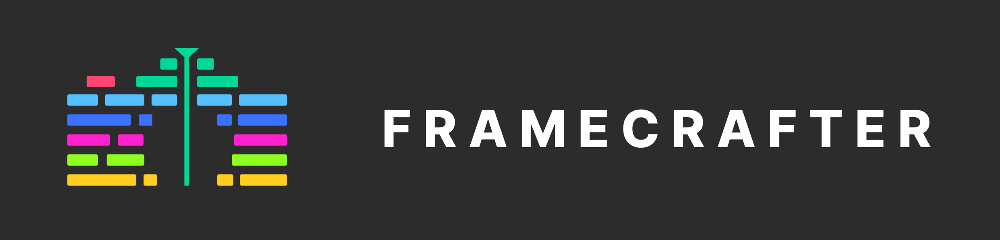

<h2 align="center">
Fast, extensible, video editor in the browser.
</h2>

---

> **Warning**
> This project is *very* early and most code here might be WIP, POC, or simply non-functional. For up-to-date information about the project status, please join us on Discord.


## 🤔 Motivation
Video is becoming the most important medium for sharing information online. Apps like TikTok and YouTube Shorts have *dramatically* democratized the production and publishing process. Tools like automagic background removal, facetracking, filters and effects come standard in these in-app editors.

However, the production process in traditional, industry-standard NLEs like Final Cut, Premiere, and Resolve has not caught up. For example, keying out a greenscreen is still a highly manual, repetitive, three or four step process.

Framecrafter is on a mission to change that. We're building an industry leading video editor from the ground up that pushes the boundaries of what's possible with today's current technology.

Our goal is for Framecrafter to be blazingly fast and highly extensible NLE with a rich plugin ecosystem that allows editors everywhere to work at the speed of thought.

Oh, and did I mention we plan to have Framecrafter run *entirely* in the browser and be free to anyone with an internet connection?

It's going to be a wild ride. So, **star the project** and **join us on Discord**. We're going to need all the help we can get 💪.

## 💻 The Tech

The backbone of our technology strategy is the new [`WebCodecs` API](https://developer.mozilla.org/en-US/docs/Web/API/WebCodecs_API). 

> The WebCodecs API gives web developers low-level access to the individual frames of a video stream and chunks of audio. It is useful for web applications that require full control over the way media is processed. For example, video or audio editors, and video conferencing.


This is the repository for 

## What is inside?

This project uses many tools like:

- [Vite](https://vitejs.dev)
- [ReactJS](https://reactjs.org)
- [TypeScript](https://www.typescriptlang.org)
- [Vitest](https://vitest.dev)
- [Testing Library](https://testing-library.com)
- [Tailwindcss](https://tailwindcss.com)
- [Eslint](https://eslint.org)
- [Prettier](https://prettier.io)

## Getting Started

### Install

Install dependencies.

```bash
pnpm install
```

Serve with hot reload at <http://localhost:5173>.

```bash
pnpm run dev
```

### Lint

```bash
pnpm run lint
```

### Typecheck

```bash
pnpm run typecheck
```

### Build

```bash
pnpm run build
```

### Test

```bash
pnpm run test
```

View and interact with your tests via UI.

```bash
pnpm run test:ui
```

## License

This project is licensed under the MIT License.
